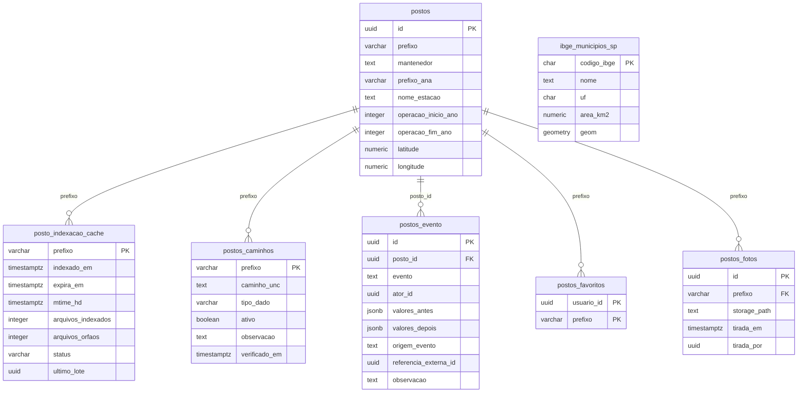
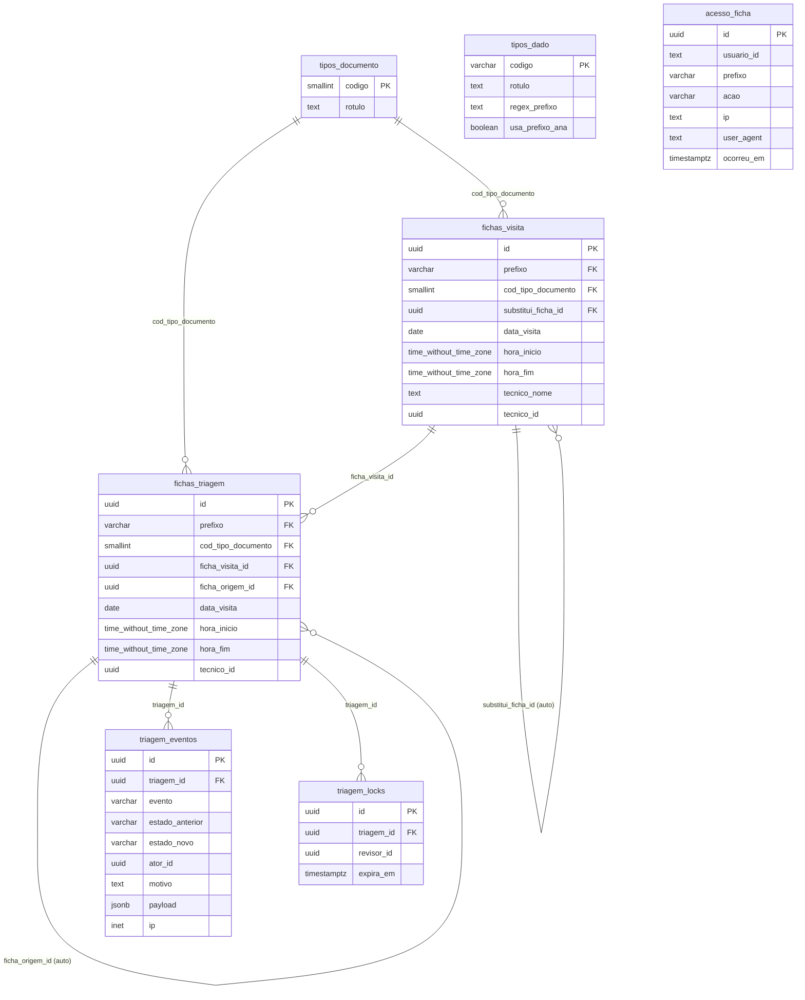
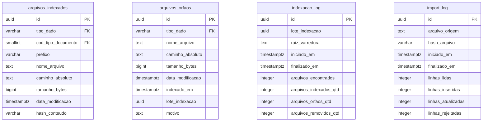
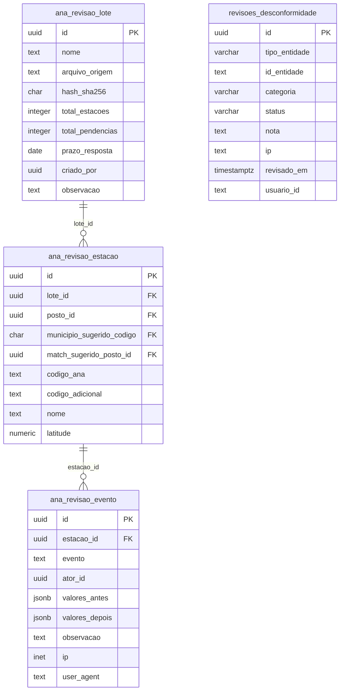
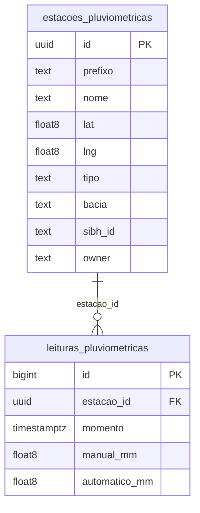
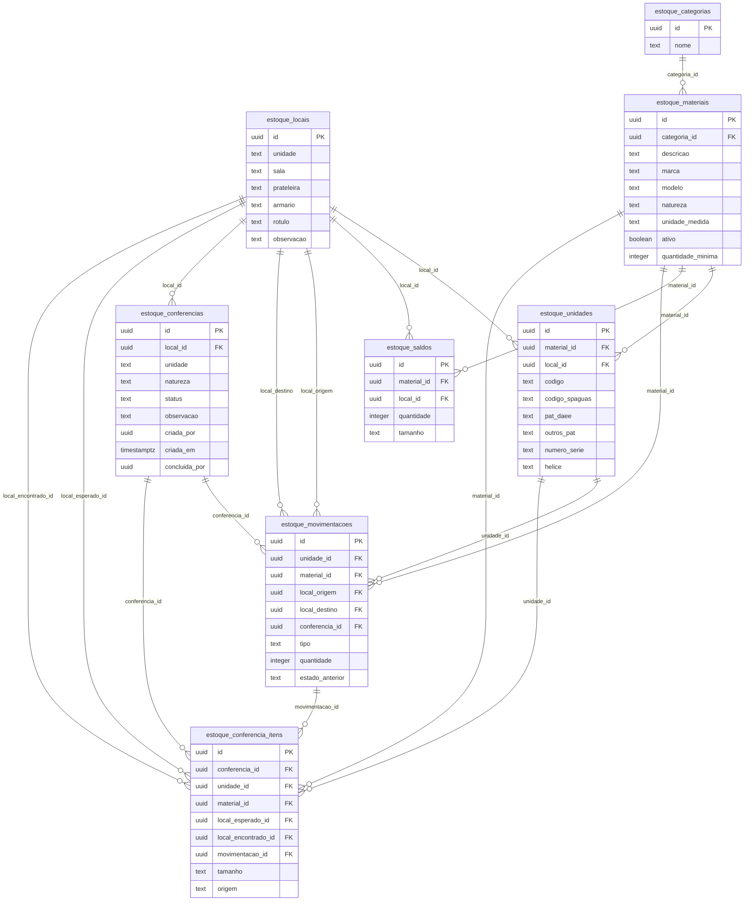
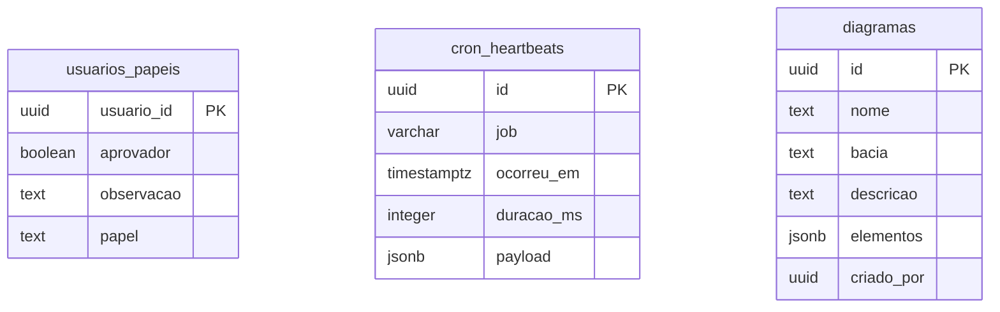

# DER do banco da aplicação DMO

Diagrama entidade-relacionamento do PostgreSQL da aplicação, e o mapa de onde ele
encosta no `Dbfch`, o SQL Server da PRODESP.

**Extraído em 10/09/2026.** Produzido pedido do gestor do órgão, para o cruzamento
entre os dois modelos.

## Procedência

Este documento não foi escrito a partir de leitura de arquivo. As 68 migrations de
`supabase/migrations/` foram aplicadas num PostgreSQL 16 com PostGIS 3.4 limpo, pelo
mesmo `db/migrate.sh` que roda em produção, e o diagrama saiu do catálogo do banco
resultante: `pg_class`, `information_schema.columns` e
`information_schema.table_constraints`.

As contagens do `Dbfch` vêm de `docs/arquitetura/schema-dbfch-prodesp.md`, extração de
catálogo de 27/08/2026, somente leitura. Documento de ESTADO envelhece por construção:
cada número vale para a data da sua extração.

| Medida | Valor |
|---|---:|
| Tabelas da aplicação | 35 |
| Views da aplicação | 2 |
| Chaves estrangeiras | 40 |
| Migrations aplicadas | 68 |
| Tabelas no `Dbfch` | 157 |
| Tabelas do `Dbfch` replicadas aqui | 0 |

`spatial_ref_sys`, `geography_columns` e `geometry_columns` são do PostGIS e não entram
na contagem. O schema `auth` tem uma tabela, que é o shim de compatibilidade descrito no
ADR-0015.

## O que este banco é, e o que ele não é

Ele **não é cópia nem espelho do `Dbfch`**. Sobe vazio e guarda apenas o que o sistema
produz e não existe no banco do órgão.

O cadastro de posto e as séries históricas de medição **não moram aqui**: são lidos
diretamente do SQL Server do órgão a cada consulta, sem cópia, sem importação e sem banco
intermediário (ADR-0023). A conexão é somente leitura por construção, e recusa `INSERT`,
`UPDATE`, `DELETE`, `MERGE` e DDL antes de a consulta sair do sistema
(`src/infrastructure/db/mssql-client.ts`). A sessão se identifica em
`sys.dm_exec_sessions` do órgão como `spaguas-dmo (somente leitura)`.

## Sobreposição com o `Dbfch`

| Tabela no DMO | Equivalente no `Dbfch` | Veredito | Situação |
|---|---|---|---|
| `postos` | `Postos` (5.790 ativos) | **Sobrepõe** | Resolvida em favor do órgão. Desde o ADR-0023 o cadastro é lido ao vivo e a tabela local permanece vazia em produção. Continua no schema porque sete tabelas ainda a referenciam, e a remoção é irreversível. |
| `usuarios_papeis` | `UsuariosPermissoesIdentity` (1.007) | **Em aberto** | Único ponto de sobreposição ainda não decidido. O sistema está no ar sem exigência de login (ADR-0024), com a estrutura preservada e desligada por chave, esperando as APIs do órgão. A tabela local guarda papel e permissão de aprovação, nunca credencial. |
| `ibge_municipios_sp` | `MunicipioDistritos` (1.889) | Complementar | Os dois nomeiam município e só um tem geometria. A malha IBGE 2024 (645 municípios, SIRGAS 2000, SRID 4674) existe para responder se a coordenada declarada do posto cai no município declarado, que é o ADR-0013. O `Dbfch` não guarda polígono. |
| `estacoes_pluviometricas`, `leituras_pluviometricas` | Nenhum, origem é o SIBH | Origem externa | Paralelo deliberado. As séries do `Dbfch` continuam lidas ao vivo e nunca copiadas; estas tabelas existem para comparar as duas fontes, o que exige tê-las lado a lado. |
| `ana_revisao_*` | Nenhum | Origem externa | Inventário publicado pela ANA, carregado como snapshot para confronto. Nunca fonte de cadastro. |
| As demais 27 | Nenhum | Só do DMO | Varredura nas 157 tabelas do `Dbfch` por ficha, inspeção, visita, estoque, almoxarifado, patrimônio, arquivo, anexo, diagrama e favorito não devolveu correspondente nenhum. |

Os únicos acertos textuais daquela varredura foram falsos positivos: `TipoMaterialFiltros`
e `TipoMaterialTuboLisos` são tipo de material de poço e não estoque, e
`PluviografoTotalMaximo` casou a busca por "foto" dentro de "Pluviogra**fo**Total".

## Os módulos

## Cadastro de posto

SOBREPÕE o `Postos` do Dbfch, e a sobreposição já está resolvida em favor do órgão: em produção esta tabela nasce VAZIA, porque o cadastro vem do SQL Server por leitura ao vivo (ADR-0023). Ela permanece no schema porque sete tabelas nossas ainda a referenciam.

## Fichas de campo: inspeção, manutenção e medição

Sem equivalente no Dbfch. A ficha digitada em campo entra como triagem e só vira ficha oficial depois de aprovação humana, com trilha append-only e trava de um aprovador por vez. O payload de cada tipo fica em `dados` (JSONB).

## Repositório de arquivos digitalizados

Sem equivalente no Dbfch. Indexação do HD de rede do órgão: o arquivo continua onde está, e aqui ficam caminho, metadado e hash. Arquivo que não casa com posto nenhum vira órfão registrado com o motivo.

## Inventário ANA e desconformidades

Origem externa (ANA). Confronto entre o inventário publicado e a rede do órgão. Uma planilha de dúvidas é um lote, com prazo de resposta; toda decisão vira evento imutável. Snapshot, nunca fonte de cadastro.

## Monitor pluviométrico

Origem externa (API do SIBH), que é outro sistema e não o Dbfch. Paralelo deliberado: as séries do Dbfch continuam lidas ao vivo e nunca copiadas, e estas tabelas existem para COMPARAR as duas fontes, o que exige tê-las lado a lado.

## Estoque: almoxarifado e patrimônio

Sem equivalente no Dbfch. Item serializado e material quantificável no mesmo modelo. A movimentação é um ledger append-only: correção não apaga linha, gera ajuste com motivo. Saldo mantido e reconciliável pela soma do ledger.

## Apoio e governança

Perfis de acesso, sinal de vida das rotinas automáticas e diagramas unifilares. `usuarios_papeis` é o ponto que muda quando a identidade do órgão entrar (ADR-0024).

